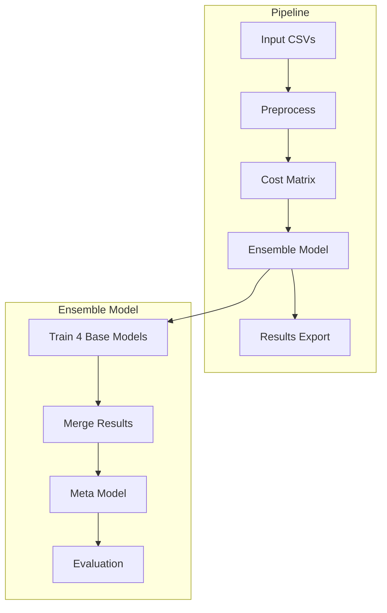

# Ensemble Model Inventory Classification

## Overview

This project implements an **unsupervised machine learning ensemble system** that classifies retail inventory items into ABC categories (A: high-priority, B: medium-priority, C: low-priority) by combining multiple clustering algorithms with inventory cost optimization [1](#0-0) .

## Installation

```bash
# Clone the repository
git clone <repository-url>
cd ensemble_model_inventory_classification

# Install dependencies
pip install -r requirements.txt  # (if requirements.txt exists)
# Or manually install:
pip install pandas numpy scikit-learn scipy
```

## Usage

### Basic Execution

1. Place retailer CSV files in the `dataset/` directory with pattern `retailer_*.csv` [2](#0-1) 
2. Run the pipeline:
   ```bash
   python src/main.py
   ```

### Configuration

Key parameters in `src/main.py` [3](#0-2) :

- `n_clusters = 3` - Number of ABC classes
- `ranking_column = "ORDERS"` - Column for ABC classification
- `predictor_columns` - Features used for clustering
- `priority = 'costs'` or `'clustering'` - Meta-model strategy
- `with_pca = False` - Enable/disable PCA dimensionality reduction

## Input Data Requirements

CSV files must contain these required columns [4](#0-3) :

| Category | Columns | Purpose |
|----------|---------|---------|
| Identifiers | `PRODUCT_ID` | Unique product identifier |
| Ranking | `ORDERS`, `UNITS`, `SALES` | ABC classification metrics |
| Inventory | `AVG_STOCK_LEVEL`, `MEDIAN_STOCK_LEVEL` | Predictor features |
| Lead Time | `LEAD_TIME_DAYS`, `STDDEV_LEAD_TIME` | Safety stock calculation |
| Costs | `UNIT_COST`, `STOCKOUT_COST`, `UNITS_STOCKOUT_COST` | Cost calculations |
| Demand | `AVG_DAILY_DEMAND`, `STDDEV_DEMAND_FINAL` | Stockout cost calculation |

## Output Structure

Results are saved to `results/DD_MM_YYYY/dataset_name/` with organized subdirectories [5](#0-4) :

```
results/
└── DD_MM_YYYY/
    └── retailer_1/
        ├── abc/
        ├── kmeans/
        ├── hc/
        ├── gmm/
        ├── merge_models/
        ├── cost_matrix/
        ├── meta_model/
        └── performance_evaluation/
```

Each directory contains:
- `{model}_summary.json` - Model parameters and metrics
- `{model}_df.csv` - Detailed results DataFrame

## Key Features

1. **Ensemble Architecture** - Combines 4 models: ABC analysis, KMeans, Hierarchical Clustering, and Gaussian Mixture Model [6](#0-5) 

2. **Cost Optimization** - Calculates inventory costs using classical ABC theory with fill rates (A: 98%, B: 95%, C: 90%) [7](#0-6) 

3. **Dual Meta-Model Strategies**:
   - Cost-based: Minimizes total inventory cost
   - Clustering-based: Maximizes silhouette score [8](#0-7) 

4. **Fault Tolerance** - Continues processing if one dataset fails [9](#0-8) 

## Architecture



## Notes

- The system uses scikit-learn for ML implementations
- PCA is optional and uses Kaiser criterion (eigenvalue > 1)
- All intermediate results are exported for full auditability
- The banner displays author information and version [10](#0-9) 
